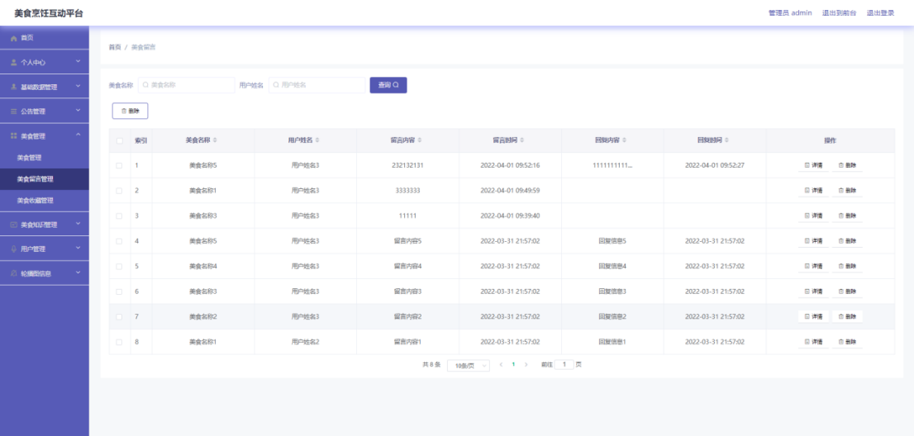

# springboot117-美食烹饪互动平台的设计与实现

>  博主介绍：
>  Hey，我是程序员Chaers，一个专注于计算机领域的程序员
>  十年大厂程序员全栈开发‍ 日常分享项目经验 解决技术难题与技术推荐 承接各类网站设计，小程序开发，毕设等。
>  【计算机专业课程设计，毕业设计项目，Java，微信小程序，安卓APP都可以做，不仅仅是计算机专业，其它专业都可以】

## 3000套系统可挑选，获取链接：https://chaerspol.github.io/

<b>QQ【获取完整源码】：674456564</b>

<b>QQ群【获取完整源码】：1058861570</b>

### 系统架构

> 前端：html | js | css | jquery | vue
>
> 后端：springboot | mybatis
> 
> 环境：jdk1.8+ | mysql | maven

# 一、内容包括
包括有  项目源码+项目论文+数据库源码+答辩ppt+远程调试成功

# 二、运行环境

> jdk版本：1.8 及以上； ide工具：IDEA； 数据库: mysql5.7及以上；编程语言: Java

# 三、需求分析

**3.1 可行性分析**

从三个不同的角度来分析，确保开发成功的前提是有可行性分析，只有进行提前分析，符合程序开发流程才不至于开发过程的中断。

**3.1.1 技术可行性**

在技术实现层次，分析了好几种技术实现方法，并且都有对应的成功案例，也有很多开源模块可以进行参考，所以从技术可行性分析来讲，实现美食烹饪互动平台是没有问题的。

**3.1.2 经济可行性**

对于身为学生的开发者而言，在经济资源上面可用者很少，为了开发美食烹饪互动平台，通过开发软件对硬件的要求，发现自己的电脑是完全能用来开发的，并且学校机房的配置也可以达到要求。最重要的是选择的技术都可以在网上找到不花钱的教程以及资料，因为不花钱，所以经济方面是具有可行性的。

**3.1.3 操作可行性**

美食烹饪互动平台的具体实现，本身参考人类的正常操作逻辑，把常用的操作习惯当做主要的导航实现，可以让使用者更快速的理解并且上手操作，实现符合逻辑的操作流程是操作可行性的具体体现。
以上就是从不同的角度来分析，确保了美食烹饪互动平台的正常开展。

**3.2 系统流程**

美食烹饪互动平台投入使用后，使用者如果能看到相应的流程操作图会提高程序的理解能力。使用者在操作美食烹饪互动平台中，应该按照本系统提供的操作流程（下图即为本系统的操作流程图）进行操作，可以减少操作失误，从而节省进入美食烹饪互动平台的时间。

# 四、功能模块

下图即为设计的管理员功能结构，管理员权限操作的功能包括管理美食，对美食留言进行回复，管理美食知识信息，管理美食知识类型，管理用户，管理公告等

下图即为设计的用户功能结构，用户权限操作的功能包括在线观看美食做法视频，查看美食食材信息以及美食详细介绍信息，查看美食知识以及公告信息等

# 五、效果图展示【部分效果图】

图5.1 美食管理界面【下图即为编码实现的美食管理界面，美食信息包括美食名称，美食照片，美食相关食材，美食做法，美食名称等信息，对于本界面展示的美食信息，管理员可以下架，上架，修改，删除，查询等】

图5.2 用户管理界面【下图即为编码实现的用户管理界面，管理员在用户管理界面中可以为本界面显示的所有用户信息进行查询，修改，删除】

图5.3 美食留言管理界面【下图即为编码实现的美食留言管理界面，用户查看美食之后，会发布跟美食相关的留言信息，管理员在美食留言管理界面对这些留言进行查看以及回复】

图5.4 美食知识管理界面【下图即为编码实现的美食知识管理界面，用户在前台查看的美食知识信息都是管理员在美食知识管理界面发布的信息，美食知识管理界面展示的美食知识信息可以让管理员修改，查询，删除等】

图5.5 美食信息界面【下图即为编码实现的美食信息界面，用户在美食信息界面查看美食详细介绍以及相关食材信息，可以观看美食做法视频，可以收藏美食，也能在美食信息界面的下方留言区域发布留言】

图5.6 美食知识界面【下图即为编码实现的美食知识界面，用户可以通过美食知识类型来筛选美食知识信息，可以在查询框中编辑美食知识名称来实现对美食知识信息的查询】

 <b>完整文章</b>
 
 
 

## 3000套系统可挑选，获取链接：https://chaerspol.github.io/

<b>QQ【获取完整源码】：674456564</b>

<b>QQ群【获取完整源码】：1058861570</b>

